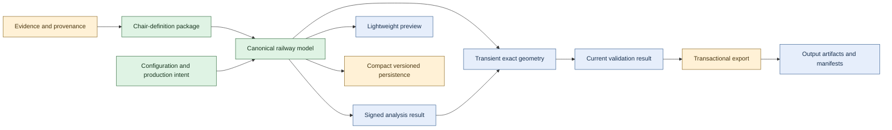

# TrackTemplate Product-System Ontology

Status: supporting semantic reference. This document and its
[machine-readable ontology](ontology/tracktemplate.jsonld) describe the stable
product system; they do not own architecture, schemas, railway terminology,
licensing decisions, provenance evidence or live delivery status.

## Authority and use

The ontology is a navigational and integration aid. Follow the more specific
canonical owner whenever it supplies a tighter requirement:

- [ARCHITECTURE.md](ARCHITECTURE.md) owns canonical state, derived views,
  persistence, validation, export and product boundaries.
- [TERMINOLOGY.md](TERMINOLOGY.md) owns accepted railway language and unresolved
  terminology reviews.
- [LICENSING_BOUNDARIES.md](LICENSING_BOUNDARIES.md) owns classifications,
  permissions, package admission and output-status rules.
- [PROVENANCE.md](PROVENANCE.md) owns source and evidence findings.
- [PROJECT_PLAN.md](PROJECT_PLAN.md) is the sole live phase, gate, risk and
  acceptance record.
- The versioned [chair-definition](schemas/chair-definition-v1.schema.json) and
  [dependency-manifest](schemas/dependency-manifest-v1.schema.json) schemas own
  their wire structures.

The ontology does not replace a JSON Schema, persistence contract, railway
solver or output-clearance decision. An ontology version can remain stable
while delivery status advances in the project plan.

## System overview

The green nodes are authoritative intent. Blue nodes are reproducible derived
state. Gold nodes are evidence or application/adaptor boundaries. A preview is
never exact-validation evidence, and an export requires current validation.

## Namespace and version

The formal ontology is OWL/RDFS expressed as JSON-LD. It uses:

- ontology IRI
  `https://github.com/Richard-Gnitnub/tracktemplate/ontology`;
- term namespace
  `https://github.com/Richard-Gnitnub/tracktemplate/ontology#`;
- compact prefix `tt:`; and
- ontology version `0.1.0`.

Standard vocabulary comes from RDF, RDFS, OWL, SKOS, Dublin Core Terms and
XML Schema. The ontology declares those namespace IRIs locally and has no
runtime or network dependency.

## Concept dictionary

### Canonical railway intent

| Machine identifiers | Meaning |
| --- | --- |
| `tt:CanonicalState`, `tt:RailwayModel`, `tt:RailwayEntity` | Durable parametric truth and its stable railway entities |
| `tt:Route`, `tt:Track`, `tt:PlainLineTrack` | Routes and track, with plain line explicitly meaning track without switches and crossings |
| `tt:Alignment`, `tt:AlignmentElement`, `tt:StraightAlignmentElement`, `tt:CircularAlignmentElement`, `tt:TransitionAlignmentElement` | Ordered centreline geometry and its declared mathematical element types |
| `tt:SpecialTrackwork`, `tt:Turnout`, `tt:Crossover`, `tt:TopologyRelation` | Explicit switches-and-crossings assets and topology; finer component labels remain terminology-controlled |
| `tt:Rail`, `tt:TrackSupport`, `tt:Timber`, `tt:ChairAssignment` | Rails, supports and stable chair placement without asserting that every support term is universally synonymous |
| `tt:Configuration`, `tt:ProductionIntent`, `tt:StableIdentity` | Versioned inputs, manufacture/export choices and identities independent of labels or host object order |
| `tt:CoordinateFrame`, `tt:Unit`, `tt:ToleranceProfile` | Explicit numerical boundary semantics that participate in deterministic results |
| `tt:VersionedRecord` | A record governed by an explicit schema identity and version |

### Chair definitions, provenance and rights

| Machine identifiers | Meaning |
| --- | --- |
| `tt:ChairDefinitionPackage`, `tt:ChairDefinition` | A neutral package and its procedural prototype definition |
| `tt:ChairComponent`, `tt:ProceduralRule`, `tt:Quantity`, `tt:Datum`, `tt:RailInterface`, `tt:ManufacturingProfile` | Named constituents, construction rules, exact quantities, frames/interfaces and manufacturing-only variants |
| `tt:ProvenanceRecord`, `tt:Evidence`, `tt:ProvenanceClassification` | Field/component/package origin, supporting evidence and controlled classification |
| `tt:Dependency`, `tt:DependencyManifest`, `tt:ManifestBearingRecord` | Output-affecting dependencies and the records that carry their fail-closed manifests |
| `tt:PermissionSet`, `tt:PermissionStatus`, `tt:ProjectStatus`, `tt:ControlledStatus` | Recorded permissions and project statuses; these are not legal-clearance opinions |
| `tt:PermissionBearingRecord`, `tt:ProjectStatusBearingRecord` | Packages and provenance/dependency records that carry the applicable controlled state |

### Derived state and signatures

| Machine identifiers | Meaning |
| --- | --- |
| `tt:DerivedArtifact`, `tt:AnalysisResult` | Reproducible signed results derived from canonical state |
| `tt:PreviewScene`, `tt:ExactGeometry`, `tt:ValidationResult` | Lightweight editing view, demand-driven exact geometry and production-grade validation |
| `tt:ExportArtifact`, `tt:ExportManifest` | Generated output and its deterministic identity/category/dependency record |
| `tt:Signature`, `tt:InputSignature`, `tt:ResultIntegritySignature` | Complete input fingerprints and fingerprints that also cover the result |

### Operations and adapters

| Machine identifiers | Meaning |
| --- | --- |
| `tt:WorkflowOperation`, `tt:EditOperation`, `tt:AnalyseOperation`, `tt:ValidateOperation`, `tt:ExportOperation` | Application commands and atomic state transitions |
| `tt:Adapter`, `tt:PersistenceAdapter`, `tt:PresentationAdapter` | Host persistence and lightweight presentation boundaries |
| `tt:ExactGeometryAdapter`, `tt:ExportAdapter`, `tt:CompatibilityAdapter` | Exact construction, transactional output and explicit legacy boundaries |
| `tt:PersistentRecord` | Compact versioned storage of canonical state rather than generated geometry |

## Relationship dictionary

| Machine identifiers | Relationship |
| --- | --- |
| `tt:containsEntity`, `tt:containsTrack` | A railway model contains stable entities and tracks |
| `tt:hasAlignment`, `tt:hasAlignmentElement`, `tt:hasTopologyRelation` | Track geometry and topology remain explicit |
| `tt:usesRail`, `tt:supportedBy`, `tt:hasChairAssignment`, `tt:usesChairDefinition` | Rails, supports and chair placements connect through domain identities |
| `tt:hasConfiguration`, `tt:hasProductionIntent`, `tt:hasStableIdentity` | Canonical records retain their inputs, production choices and identities |
| `tt:packagesChairDefinition`, `tt:hasComponent`, `tt:hasProceduralRule`, `tt:hasQuantity`, `tt:hasDatum`, `tt:hasRailInterface`, `tt:hasManufacturingProfile` | A chair package retains procedural prototype and manufacturing structure |
| `tt:hasProvenance`, `tt:supportedByEvidence`, `tt:classifiedAs`, `tt:hasPermissionSet`, `tt:hasPermissionStatus` | Evidence and rights classifications stay attached to affected data |
| `tt:hasDependencyManifest`, `tt:recordsDependency`, `tt:hasProjectStatus` | Packages and output records expose fail-closed dependency state |
| `tt:derivedFrom`, `tt:protectedBySignature`, `tt:hasResultIntegritySignature`, `tt:invalidatedBy` | Derived state names its canonical source, complete input/result signatures and invalidating edits |
| `tt:validatedBy`, `tt:describedByManifest`, `tt:requiresCurrentValidation` | Output is tied to current validation and deterministic manifests |
| `tt:persistsCanonicalState`, `tt:consumes`, `tt:produces` | Persistence and workflows state their semantic inputs and outputs |

Datatype properties keep boundary values explicit:
`tt:identifierValue`, `tt:schemaIdentifier`, `tt:schemaVersion`,
`tt:unitSymbol`, `tt:frameIdentifier`, `tt:signatureValue`,
`tt:classificationCode` and `tt:statusCode`.

## Controlled individuals

The following individuals project the exact policy and schema codes. Their
meanings remain owned by `LICENSING_BOUNDARIES.md` and the versioned schemas.

| Kind | Machine identifiers |
| --- | --- |
| Provenance classifications | `tt:classification-engineering-method`, `tt:classification-engineering-fact`, `tt:classification-project-measurement`, `tt:classification-project-derivation`, `tt:classification-user-design`, `tt:classification-templot-source-expression`, `tt:classification-templot-reference-data`, `tt:classification-templot-media-output`, `tt:classification-third-party-evidence`, `tt:classification-generated-output` |
| Permission statuses | `tt:permission-permitted`, `tt:permission-restricted`, `tt:permission-reference-only`, `tt:permission-unknown`, `tt:permission-not-applicable` |
| Project statuses | `tt:project-status-project-cleared`, `tt:project-status-restricted`, `tt:project-status-reference-only`, `tt:project-status-unknown` |

## Load-bearing semantic rules

1. `tt:CanonicalState` and `tt:DerivedArtifact` are disjoint. Generated paths,
   shapes, caches and output files do not become railway truth.
2. Every `tt:DerivedArtifact` identifies its canonical source with
   `tt:derivedFrom` and its complete input fingerprint with
   `tt:protectedBySignature`.
   A `tt:AnalysisResult` also has a `tt:hasResultIntegritySignature`
   relationship to the fingerprint covering its inputs and result.
3. `tt:PreviewScene` is disjoint from `tt:ValidationResult`; a visually
   plausible preview does not qualify production geometry.
4. Every `tt:ExportArtifact` is `tt:validatedBy` a current validation result
   and `tt:describedByManifest` an export manifest.
5. `tt:ExportOperation` `tt:requiresCurrentValidation`; staging, verification,
   commit and rollback remain application/export responsibilities.
6. A `tt:ChairDefinitionPackage` contains exactly one
   `tt:ChairDefinition`, exactly one `tt:DependencyManifest`, and recorded
   provenance. The wire schema supplies the more detailed closed-world rules.
7. A `tt:ChairDefinition` has named components, datums and rail interfaces.
   Prototype definition and manufacturing compensation remain distinct.
8. A `tt:PersistentRecord` `tt:persistsCanonicalState`; it does not make
   preview or exact geometry authoritative.
9. Rights provenance follows output-affecting data. A comparison oracle or
   accessible external artifact is not silently promoted into cleared
   production input.

## Existing contract mappings

The ontology deliberately stays coarser than the executable schemas:

- A transition-state JSON payload is a `tt:PersistentRecord` that
  `tt:persistsCanonicalState`; its current calculation is an
  `tt:AnalysisResult` protected by `tt:InputSignature` and
  `tt:ResultIntegritySignature`.
- The chair-package v1 payload is a `tt:ChairDefinitionPackage`. Its components,
  quantities, procedures, datums, interfaces, manufacturing profiles, lineage
  and manifest retain their schema-defined fields and validation rules.
- A dependency-manifest payload is a `tt:DependencyManifest` containing
  `tt:Dependency` records and a controlled `tt:ProjectStatus`.
- A FreeCAD document adapter may persist these records, but a document object,
  label, preview or `Part` shape is not their stable identity.

When a mapping cannot preserve a schema field, stable identity, unit, frame,
ordering, signature, provenance classification or fail-closed status, the
mapping is incomplete.

## Maintenance

- Change this ontology only when an accepted stable concept or relationship
  changes. Record phase progress only in `PROJECT_PLAN.md`.
- Update the human and JSON-LD representations together.
- Preserve ontology term IRIs once published. Rename by adding a new term and
  an explicit compatibility/deprecation relationship rather than reusing an
  old IRI with a different meaning.
- Run `.venv/bin/python tests/validate_ontology.py` after either representation
  or a synchronized policy/schema code changes.
